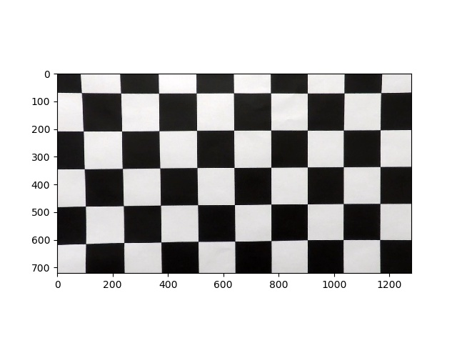
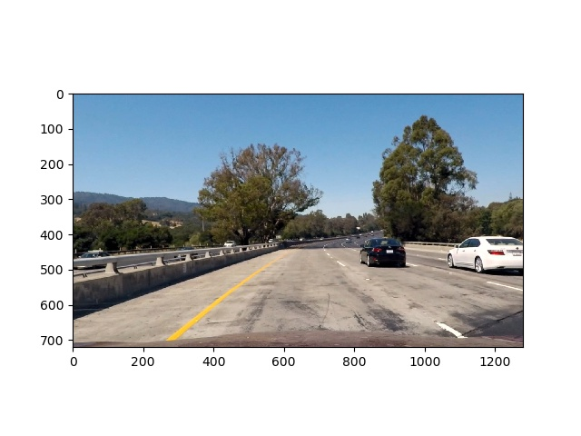
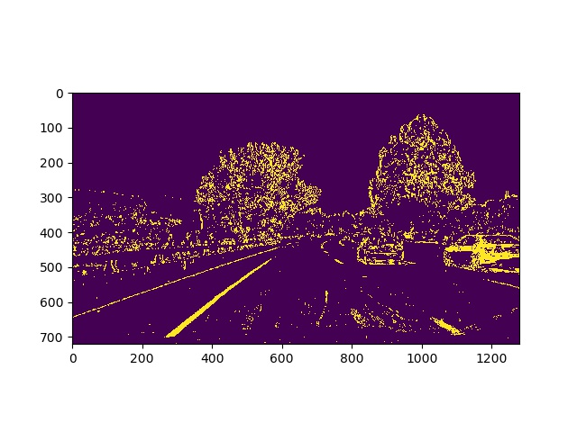
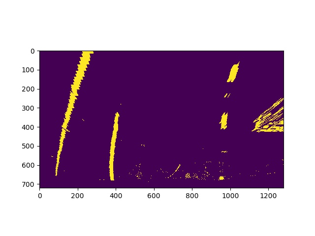

## Camera Calibration
Camera calibration was done using the calibration chessboard images provided by Udacity. Calibration parameters was calculated using the openCV function, findChessBoardCorners and calibrateCamera. The result was saved into pickle file (camera_calibration.p)

This is the original distorted image

Below is the undistorted image

## Distortion-corrected Image

Using the function openCV undistort(), the images from the video were first undistorted.
Below is a sample of before and after the undistort() function

## Color & gradient thresholding

HSV was used to identify the color of the line, and Sobel X was used to identify the gradient of the line.
Color thresholding was done in the S channel of the HSV. The result of both thresholding was combined.
Below is an example of before and after thresholding

## Perspective Transform

Perspective transform was done on the result from thresholding. Perspective transform was done using openCV function warpPerspective()

Source points were identified manually by eye
src = np.float32([ 
	[830, 525], #top right
	[1080, 670], #bot right
	[340, 670], #bot left
	[510, 525]]) #top left

Destination X points were calculated by taking the mid point of the X src points 
e.g. (830 + 1080) / 2 =~ 960
dst = np.float32([[960, 525], 
					[960,670], 
                     [400, 670], 
                   	[400, 525]])

Below is the sample image after transformation

## Polynomial Fit

Polynomial fitting was done using the numpy function, polyfit()
The function is defined in the video_process.py line 77 - 149

## Curvature and Distance from center

Curvature calculation is defined in video_process.py (line 195 - 211) and Distance from center is defined in video_process.py (line 213 - 243)
The resulting value is augmented as text into the video

## Discussion

There is some problem with the line identification when the brightness of the road is high. Further checking of the brightness of the image should be implemented, and reduce the brightness when needed. A better smoothing function should be implemented to provide a better augmented polygon (the current one is a bit wobbly)

A possible failure is when the lane width (distance between left and right line) changes, since the algorithm that tell whether a new sliding window should search for a new polynomial coefficient is implemented when the distance is between 2 and 3.2, if the lane width changes it might cause a problem with this threshold. An approach to fix the problem would be to continually use sliding window after several frames (although might be slower) instead of using the one from previous frames, and only use sliding window when the distance is outside threshold.

